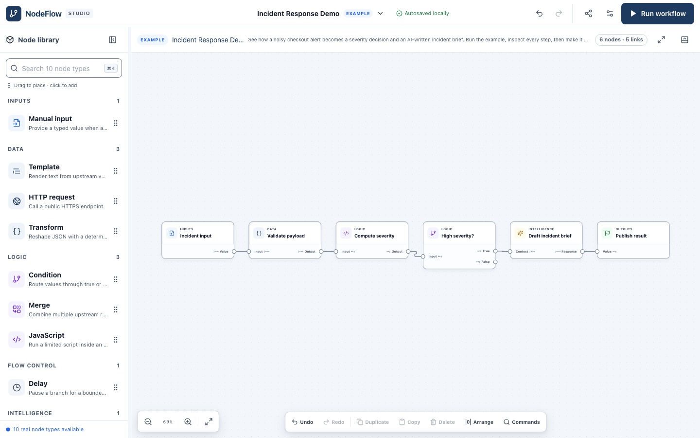
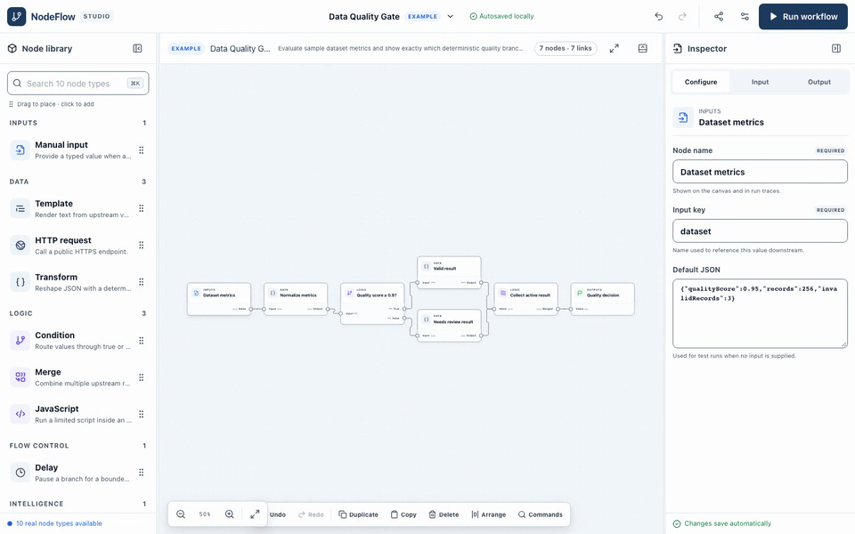
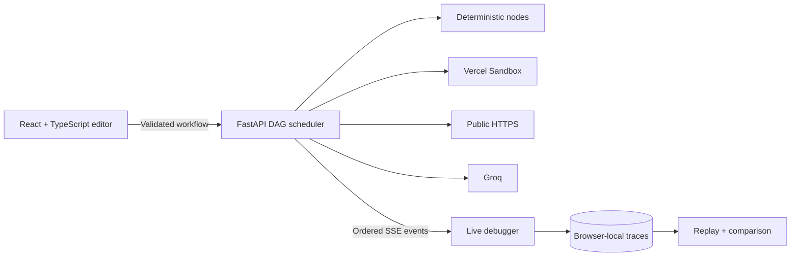

<div align="center">

# NodeFlow

### Build visually. Execute for real. Debug every step.

A visual workflow studio that turns connected nodes into real backend execution—and makes the entire run inspectable.

[**Open the live studio →**](https://node-flow-liard.vercel.app) · [Quick start](#run-locally) · [Architecture](docs/ARCHITECTURE.md) · [Security](docs/SECURITY.md) · [Release evidence](docs/RELEASE.md)

</div>



A workflow diagram tells you what *should* happen. NodeFlow shows you what **did** happen: the input each node received, the output it returned, the branch it took, the time it spent, and the failure that stopped the run.

Build a graph, run it through FastAPI, and follow real server events on the canvas. Then inspect a node, repair the workflow, rerun it, and compare the results. No sign-up is required. Drafts and retained run history live in your browser.

## Try it in two minutes

1. Open the [live studio](https://node-flow-liard.vercel.app) on a desktop-sized screen.
2. Open **Templates and workspace settings** and choose **Data Quality Gate**. Confirm the replacement.
3. Click **Run workflow**, then **View final output**. The sample produces a `valid` result and visibly skips the unused branch.
4. Select **Dataset metrics**. Change `qualityScore` from `0.96` to `0.5` in **Default JSON**, then leave the field to apply the JSON edit.
5. Run again. The output now says `needs-review`. In **Runs**, choose **Compare** to see what changed, or **Replay** to step through the saved events.

Data Quality Gate needs no API keys. The default **Incident Response Demo** adds real isolated JavaScript and Groq text generation; those integrations depend on the deployment's available free-tier allowances.

[Watch the 62-second walkthrough](docs/media/walkthrough.mp4) — edit real data, run it, inspect the result, trigger an error, fix it, and replay.



## What you can build

| Template | Real execution path | What to inspect |
| --- | --- | --- |
| **Incident Response Demo** | Incident input → payload transform → sandboxed severity calculation → condition → Groq brief → output | The severity decision and the human-reviewable incident brief |
| **GitHub Release Digest** | Repository input → public GitHub HTTPS request → JSON projection → Groq digest → output | Exactly which release metadata the model received |
| **Data Quality Gate** | Dataset metrics → transform → condition → active result → merge → output | Both branch outcomes and why the other branch was skipped |

The incident template's “Validate payload” step currently passes JSON through with `@`; it is not a domain-specific incident schema validator. Server-side workflow and JSON validation still apply. “Publish result” captures an output in the debugger; it does not post to an external service.

## A debugger, built into the canvas

- **Compose:** drag nodes from the library or click to add them. Connect compatible ports by dragging or clicking the source and destination port buttons.
- **Configure:** select a node to edit its name, JSON, expression, URL, script, or prompt. Field errors stay next to the input; server graph errors point back to the workflow.
- **Execute:** independent ready nodes can run concurrently. Running, completed, failed, and skipped states come from backend events.
- **Inspect:** use **Timeline**, **Node data**, and **Timing** for ordered events, values, logs, errors, and node durations. Copy or download the displayed JSON preview.
- **Recover:** stop a run, inspect a failure, edit its cause, and run again. Missing credentials and exhausted quotas stay visible as failures.
- **Revisit:** retain the latest ten terminal traces in IndexedDB. Replay an unchanged graph without executing it again, or compare revisions of the same workflow.
- **Keep your work:** drafts autosave locally. Export a versioned workflow JSON file before replacing a draft, switching browsers, or clearing browser data.

Replay is available when a trace matches the current node and edge structure; configuration-only edits do not disable it. Comparison accepts revisions of the same workflow. The JSON inspector limits large previews to 20,000 characters; its copy/download actions export that displayed preview.

## Ten focused node types

| Node | Purpose | Configuration example |
| --- | --- | --- |
| **Manual input** | Start with a JSON value | `{"qualityScore": 0.96, "records": 128}` |
| **Template** | Render text from incoming data | `Service: {{ input.service }}` |
| **HTTP request** | Fetch public JSON or text over HTTPS | `https://api.github.com/repos/vercel/next.js/releases?per_page=3` |
| **Transform** | Select or reshape JSON deterministically | `@.body` or `{"name":"@.service"}` |
| **Condition** | Send the incoming value to a true or false branch | `{"path":"qualityScore","operator":"gte","value":0.9}` |
| **Merge** | Combine active incoming results | `array` or `object` strategy |
| **JavaScript** | Run a function body in a fresh isolated Sandbox | `return { ...input, reviewed: true };` |
| **Delay** | Pause a branch within the run deadline | Duration in milliseconds |
| **LLM** | Generate bounded text through Groq | System instructions + `{{ input }}` prompt |
| **Output** | Capture a named final result | `qualityDecision` |

Transform supports `@`, dotted lookups, and JSON projections; it does not evaluate arbitrary code. Condition operators are `eq`, `ne`, `gt`, `gte`, `lt`, `lte`, `contains`, and `exists`. Use JavaScript for custom computation. It has no network access, injected secrets, or user-installed npm packages.

### Editor controls

| Action | Control |
| --- | --- |
| Select multiple nodes | Shift-click |
| Move selected nodes | Arrow keys, 16 pixels per step |
| Duplicate | ⌘/Ctrl + D or **Duplicate** |
| Copy / paste nodes | ⌘/Ctrl + C / V inside the editor |
| Undo / redo | ⌘/Ctrl + Z / Shift + Z |
| Delete selection | Delete / Backspace or **Delete** |
| Arrange and fit | **Arrange**, then **Fit view** |
| Resize panels | Drag the divider, or focus it and use arrow keys |
| Navigate tabs | Arrow keys, Home, End |

Text fields retain their normal editing shortcuts. At widths of 900 pixels or less, NodeFlow presents a compact workflow viewer; full canvas editing and detailed debugging are desktop features. Reduced-motion preferences are respected.

## How it works



**Frontend:** React 18, strict TypeScript, Vite, React Flow, Zustand, and a light design system. **Backend:** FastAPI, Pydantic contracts, an asynchronous bounded DAG scheduler, and SSE. **Deployment:** Vercel Services serves the frontend and Python API on one domain.

The frontend types are generated from the backend OpenAPI contract. The browser never owns provider credentials or executes user-authored JavaScript. Read the [architecture and execution lifecycle](docs/ARCHITECTURE.md) for the implementation details and trust boundaries.

## Run locally

Use **Node.js 22.12+ within the 22.x line**, npm, and **Python 3.10+**. Python 3.13 is used by CI. Run these commands from a terminal:

```bash
git clone https://github.com/ayushgundecha/NodeFlow.git
cd NodeFlow
npm ci --prefix frontend
python3 -m venv backend/venv
backend/venv/bin/python -m pip install -r backend/requirements-dev.txt
./scripts/dev.sh
```

Open [localhost:3000](http://localhost:3000). Vite proxies `/api` requests to FastAPI at port 8000. The health endpoint is [localhost:8000/api/v1/health](http://localhost:8000/api/v1/health); local interactive API documentation is at [localhost:8000/docs](http://localhost:8000/docs).

The startup script uses POSIX paths and is intended for macOS, Linux, or WSL. Choose **Data Quality Gate** for a complete run without provider setup. Missing providers do not prevent the editor or deterministic nodes from working.

### Enable real integrations

Configuration is **server-only**. Use [.env.example](.env.example) as a reference and export the values in the shell that starts the backend; the development script does not automatically load `.env` files.

| Variable | When needed | Purpose |
| --- | --- | --- |
| `GROQ_API_KEY` | LLM nodes | Dedicated Groq free-tier project key |
| `NODEFLOW_AI_MODEL` | Optional | Defaults to `openai/gpt-oss-20b` |
| `VERCEL_TOKEN`, `VERCEL_PROJECT_ID`, `VERCEL_TEAM_ID` | JavaScript with direct local FastAPI | All three are needed for Sandbox authentication |
| `NODEFLOW_ENV` | Production | Set to `production`; Vercel Preview/Production also select safe defaults |
| `NODEFLOW_CORS_ORIGINS` | Production and Preview | Explicit comma-separated browser origins |
| `NODEFLOW_RATE_LIMIT_SALT` | Production and Preview | Private random value for anonymous rate-limit keys |

Vercel deployments and authenticated `vercel dev` supply short-lived Sandbox OIDC. Do not copy an OIDC token into a persistent environment file. Never put credentials in a `VITE_` variable, workflow file, prompt, or node field.

To serve the compiled frontend through FastAPI locally:

```bash
npm run build --prefix frontend
backend/venv/bin/uvicorn main:app --app-dir backend --host 127.0.0.1 --port 8000
```

The local build writes to `backend/public/`; Vercel builds use `frontend/dist/`. Both are generated and ignored by Git.

## Verify the project

```bash
# Frontend
cd frontend
npm run lint
npm run typecheck
npm run test -- --coverage
npm run build
npm audit --audit-level=high

# Browser journeys, real local API, accessibility, and visual baselines
npx playwright install chromium
npm run test:e2e

# Backend, from the repository root
cd ../backend
venv/bin/ruff check .
venv/bin/ruff format --check .
venv/bin/mypy
venv/bin/pytest --cov --cov-report=term-missing
venv/bin/python -m scripts.check_openapi
venv/bin/pip-audit -r requirements.txt
```

Browser tests use the compiled app with a real local FastAPI server. Provider-free journeys do not fabricate successful AI or JavaScript execution. An explicitly enabled production smoke suite exercises all three templates with real providers. See [testing and release evidence](docs/RELEASE.md) for commands, measurement conditions, coverage scope, and remaining release gates.

When intentionally changing the shared contract:

```bash
cd backend
venv/bin/python -m scripts.export_openapi
cd ../frontend
npm run contracts:generate
```

Commit both generated contract files with the model change. CI checks that regeneration leaves no diff.

## Security, privacy, and limits

NodeFlow is a bounded public demonstration. Avoid entering sensitive or production data.

- **JavaScript isolation:** a fresh Vercel Sandbox per node, deny-all network policy, empty injected environment, bounded source/output/logs, and timeout cleanup.
- **Public HTTP:** HTTPS only, public-address checks, pinned DNS results, redirect revalidation, filtered headers, and bounded responses.
- **AI:** a server-only Groq key, bounded prompts/results, and visible provider failures. AI output needs human review; there is no tool-calling agent or automated incident response.
- **Local retention:** drafts and the latest ten terminal traces stay in the visitor's browser. Running a workflow sends its content to the backend and, where applicable, external providers. Runtime logs are restricted to operational metadata.
- **Bounded execution:** 25 nodes, 40 edges, four concurrent nodes, 30 seconds per run, and process-local visitor limits. Provider allowances and deployment-wide abuse controls also apply.
- **Zero-spend operation:** Vercel Hobby and a dedicated Groq free-tier key. No paid fallback, automatic top-up, or fabricated success when a quota is exhausted.

The [security review](docs/SECURITY.md) maps protections to tests. The [operations guide](docs/OPERATIONS.md) covers deployment, provider failures, quota handling, rollback, and control limitations.

## Troubleshooting

| Symptom | What to do |
| --- | --- |
| JavaScript reports `sandbox_unavailable` | Use authenticated `vercel dev`, or provide all three Sandbox credentials to the backend. |
| AI is unavailable or rate limited | Check the dedicated Groq project's key, model access, and remaining allowance. Retry after the provider's reset; do not enable paid fallback. |
| HTTP destination is blocked | Use a public HTTPS endpoint. Localhost, private networks, credential-bearing URLs, and unsafe redirects are intentionally rejected. |
| A branch is skipped | Inspect the condition's input and rule. Inactive branches do not execute. |
| A run disconnects | Check connectivity, inspect the partial trace, and rerun when ready. A disconnected run cannot be resumed. |
| Replay is disabled | Restore the same node/edge structure or compare compatible revisions instead. |
| A draft cannot be saved | Export it to JSON. Browser storage may be disabled, full, or cleared. |
| Production configuration fails at startup | Set explicit CORS origins and the private rate-limit salt in the correct Vercel environment. |

## Scope and contribution

This version intentionally omits accounts, collaboration, schedules, cross-device sync, a secrets vault, authenticated third-party API connections, Python execution, arbitrary npm packages, and dark mode. Runs and quotas are not durable across API process restarts. Compact screens show the workflow rather than the full desktop editor.

For development, add or update the typed registry, backend models/adapters, generated contracts, and meaningful tests together. Use Beads (`bd prime`, `bd ready`) for durable project tasks. See [AGENTS.md](AGENTS.md) for repository workflow conventions.

[Architecture](docs/ARCHITECTURE.md) · [Security evidence](docs/SECURITY.md) · [Operations](docs/OPERATIONS.md) · [Release report](docs/RELEASE.md) · [Portfolio case study](docs/CASE_STUDY.md)
