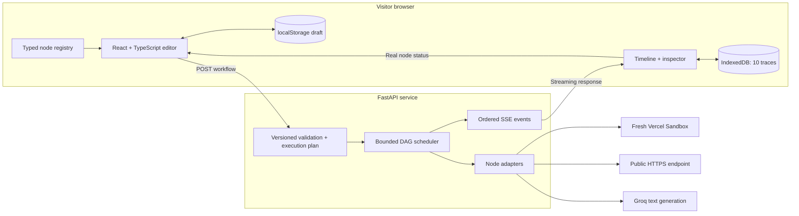
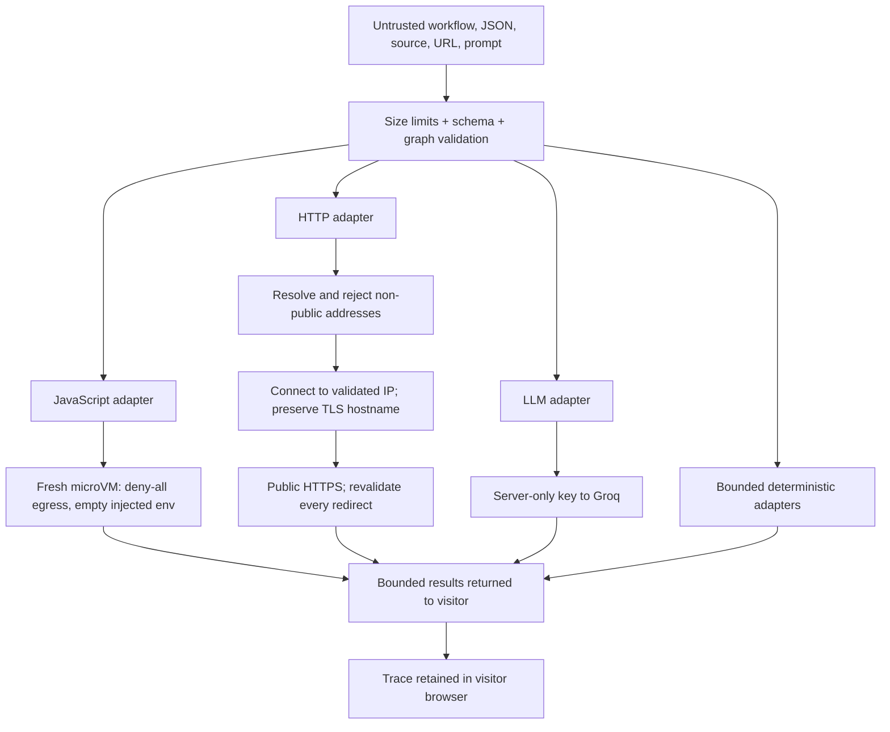

# Architecture

NodeFlow pairs a React editor with a Python execution service. The browser owns the editable draft and retained traces. FastAPI owns validation, scheduling, integrations, and the authoritative event stream.



## Two contracts, two purposes

The portable **editor format**, `nodeflow.workflow/2`, contains positions, labels, configuration, edges, and workspace metadata. Import validates its structure and references. Browser persistence strips transient execution status.

The **execution contract**, `schemaVersion: "1.0"`, is a discriminated union of ten typed nodes. A frontend adapter translates the editor draft into this contract. Pydantic models generate the checked-in OpenAPI document; `openapi-typescript` generates the frontend types. Contract drift is checked in CI.

Neither importing a file nor matching a TypeScript type proves the graph is executable. Server validation checks node configuration, duplicate IDs, references, handle direction, port compatibility, required inputs, graph size, and cycles before creating execution layers.

## Execution lifecycle

```mermaid
sequenceDiagram
  actor Visitor
  participant Editor
  participant API as FastAPI
  participant DAG as Scheduler
  participant Adapter
  participant History as Browser history
  Visitor->>Editor: Run workflow
  Editor->>API: POST /api/v1/workflows/validate
  API-->>Editor: Issues or execution order
  Editor->>API: POST /api/v1/runs
  API-->>Editor: run.started
  API->>DAG: Execute validated graph
  DAG-->>Editor: node.queued / node.started
  DAG->>Adapter: Input + cancellation context
  Adapter-->>DAG: Output, logs, or typed failure
  DAG-->>Editor: node.completed / node.failed / node.skipped
  DAG-->>Editor: run.completed / run.failed
  Editor->>History: Save terminal trace locally
  Visitor->>Editor: Replay or compare
  History-->>Editor: Recorded events; no provider call
```

The scheduler runs up to four ready nodes concurrently. It waits for dependencies, passes values by named handles, and marks inactive condition branches as skipped. Merge receives results from the active branches. Graphs are bounded to 25 nodes and 40 edges; runs have a 30-second deadline. Editing the executable graph aborts the current client request and clears obsolete live state.

Each SSE event has a run ID, contiguous sequence, timestamp, and typed payload. The client rejects inconsistent ownership, gaps, malformed frames, and invalid events; duplicate or post-terminal events cannot create a second result. A disconnected stream is not a completed run. Cancellation closes the client request and propagates to scheduler cleanup; there is no durable background job to resume after a server restart.

## Trust boundaries



JavaScript never runs in the FastAPI process or browser. It runs as a function body in a fresh Sandbox, receives `input` and a bounded context, and returns JSON. Its filesystem is disposable. This is isolation from the API host, not a promise that untrusted code cannot access its own microVM.

HTTP uses HTTPS only, rejects credentials and private/reserved DNS answers, pins the validated address for the connection, preserves certificate hostname verification, and revalidates redirects. There is no user-configured host allowlist. Only a small set of request headers is accepted; cookies, authorization, ambient proxy settings, and automatic redirects are disabled.

Groq receives the configured system prompt and rendered input. Its output is untrusted text for human review; it has no tool access. Workflow content necessarily leaves the browser during execution and may reach the chosen HTTPS endpoint, Sandbox, or Groq. Browser-local persistence does **not** mean local-only processing.

## Deliberate tradeoffs

| Choice | Benefit | Boundary |
| --- | --- | --- |
| React + FastAPI | Explicit frontend/runtime separation | Two language toolchains |
| Browser-local drafts and traces | No account or workflow database | No cross-device sync or recovery after storage deletion |
| SSE over a POST response | Ordered events from a real run | No durable stream reconnection or background scheduling |
| Fresh sandbox per JavaScript node | Isolated untrusted code | Cold-start latency and provider quotas |
| Small graph limits | Predictable public-demo resource use | Not a bulk processing engine |
| Process-local rate limiter | No paid datastore | Not a global abuse budget; deploy edge controls too |

## Source map

| Area | Entry point |
| --- | --- |
| Workspace composition | [`WorkspaceShell.tsx`](../frontend/src/features/shell/WorkspaceShell.tsx) |
| Node definitions and inspector fields | [`registry.ts`](../frontend/src/domain/nodes/registry.ts) |
| Portable workflows | [`workspacePersistence.ts`](../frontend/src/features/editor/workspacePersistence.ts) |
| Client execution lifecycle | [`useWorkflowRuntime.ts`](../frontend/src/features/runtime/useWorkflowRuntime.ts) |
| Stream decoder | [`runEventStream.ts`](../frontend/src/features/runtime/runEventStream.ts) |
| Trace storage and comparison | [`runHistory.ts`](../frontend/src/features/runs/runHistory.ts) |
| API contracts | [`workflow.py`](../backend/app/models/workflow.py), [`events.py`](../backend/app/models/events.py) |
| Validation and planning | [`workflow_validation.py`](../backend/app/services/workflow_validation.py) |
| DAG execution | [`scheduler.py`](../backend/app/services/scheduler.py) |
| Event projection | [`run_stream.py`](../backend/app/services/run_stream.py) |
| Integrations | [`services/`](../backend/app/services/) |
